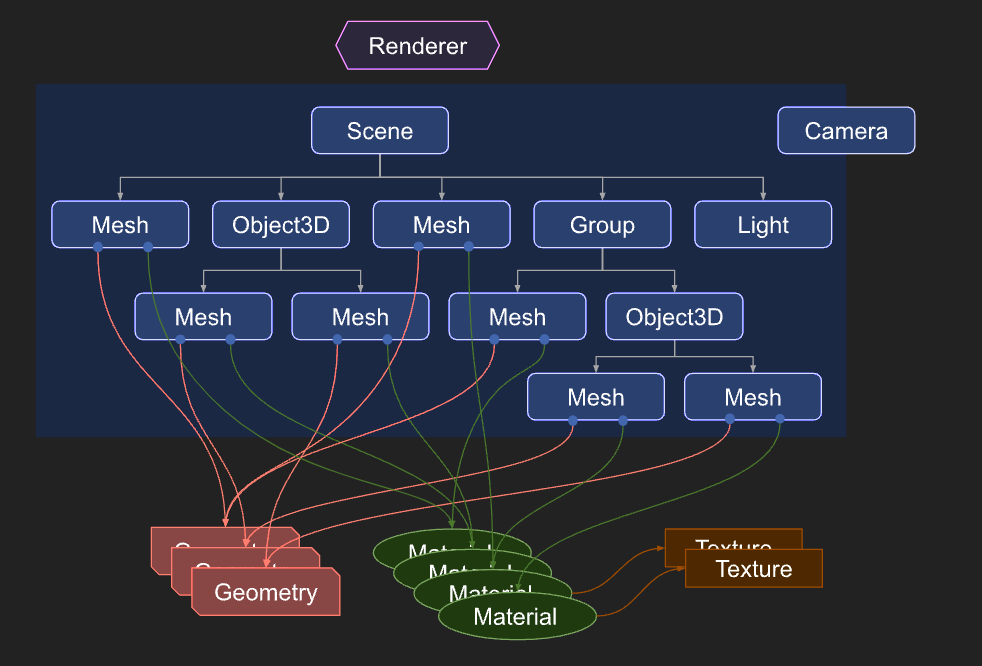
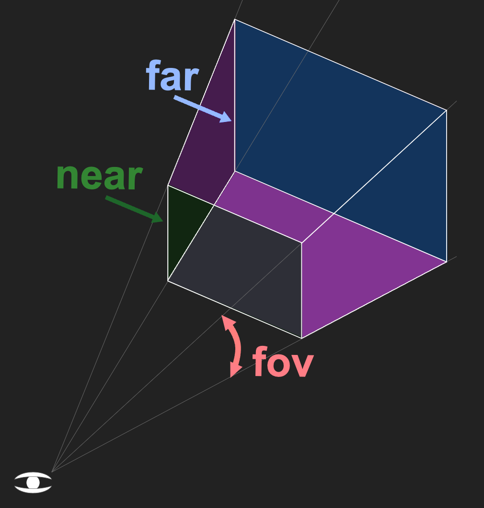
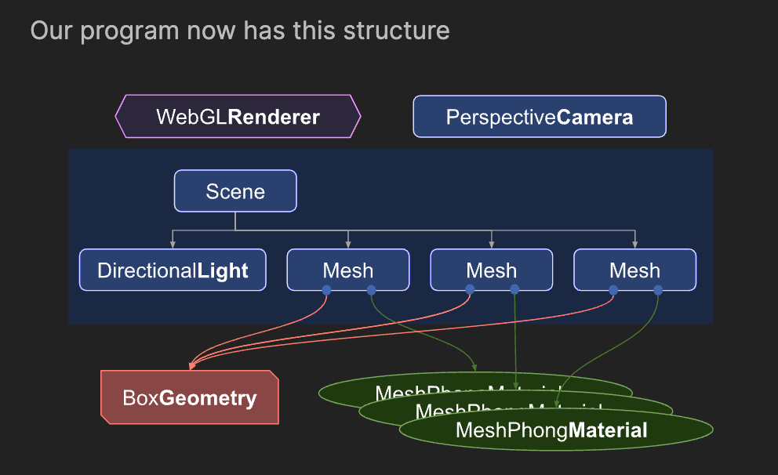

ThreeJS != WebGL

WebGL is a very low-level system that only draws points, lines and triangles.


# Prerequisites

### Destructuring
Assume an object `const dims = {width: 300, height: 150}` 

Old code: \
```
const width = dims.width;
const height = dims.height;
```

New code: \
`
const {width, height} = dims;
`

Destructuring works with arrays too. Assume an array const position = [5, 6, 7, 1];

Old code: \
```
const y = position[1];
const z = position[2];
```

New code: \
`
const [, y, z] = position;
`

### The rest parameter
The rest parameter can be used to consume any number of parameters. Example: \
```
function log(className, ...args) {
   const elem = document.createElement('div');
   elem.className = className;
   elem.textContent = args.join(' ');
   document.body.appendChild(elem);
 }
```

### The spread operator `...`
Can be used to expand an iterable into arguments \
```
const position = [1, 2, 3];
someMesh.position.set(...position);
```

or copy an array \
```
const copiedPositionArray = [...position];
copiedPositionArray.push(4); // [1,2,3,4]
console.log(position); // [1,2,3] position is unaffected
```

or to merge objects \
```
const a = {abc: 123};
const b = {def: 456};
const c = {...a, ...b};  // c is now {abc: 123, def: 456}
```

### Arrow functions
`
const foo = (args) => {/* code */};
` \
is a shortcut for \
`
const foo = (function(args) {/* code */}).bind(this);
`


# Fundamentals



**Renderer**: Main object of three.js. You pass a Scene and a Camera to it and it renders (draws) the portion of the 3D scene that is inside the frustum of the camera as a 2D image to a canvas

**Scenegraph**: a tree like structure, consisting of various objects like a Scene object, multiple Mesh objects, Light objects, Group, Object3D, and Camera objects. A Scene object defines the root of the scenegraph and contains properties like the background color and fog. These objects define a hierarchical parent/child tree like structure and represent where objects appear and how they are oriented. Children are positioned and oriented relative to their parent. For example the wheels on a car might be children of the car so that moving and orienting the car's object automatically moves the wheels. 

**Camera**: is half in half out of the scenegraph. This is to represent that in three.js, unlike the other objects, a Camera does not have to be in the scenegraph to function. Just like other objects, a Camera, as a child of some other object, will move and orient relative to its parent object.

**Mesh** objects represent drawing a specific Geometry with a specific Material. Both Material objects and Geometry objects can be used by multiple Mesh objects. 

Basically, a mesh represents the combination of 3 things:
1. A Geometry (the shape of the object)
2. A Material (how to draw the object, shiny or flat, what color, what textures(s) to apply, etc.)
3. The position, orientation, and scale of that object in the scene relative to its parent

**Geometry** objects represent the vertex data of some piece of geometry like a sphere, cube, plane, dog, cat, human, tree, building, etc... Three.js provides many kinds of built in geometry primitives e.g. BoxGeometry, ConeGeometry, SphereGeometry etc.

**Material** objects represent the surface properties used to draw geometry including things like the color to use and hwo shiny it is.

**Texture** objects generally represent images either loaded form image files, generated from a canvas or rendered from another source.

**Light** objects represent different kinds of lights
Some of these include:
- Ambient light: Light from the environment. Indirect result of other sources of light e.g. daylight in your room
- Directional light: A light that gets emitted in a specific direction. This light will behave as though it is infinitely far away. The rays produced from it are all parallel. e.g. sunlight
- Spotlight: emits light in the form of a cone





The final code in /threejs-code has this structure:



## More Notes
**gLTF** stands for Graphics Library Transmission Format \
A glTF file uses one of two possible file extensions: .gltf (JSON/ASCII) or .glb (binary).